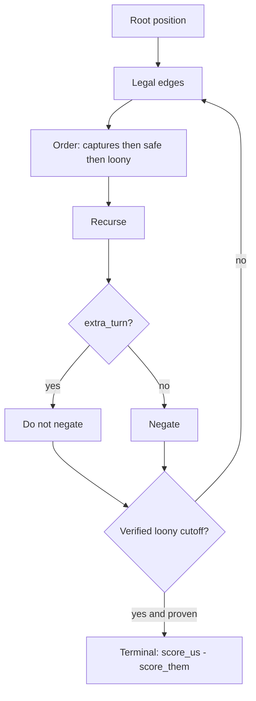

# Spec: Phase 2 exact solver → Perfect (KET-18)

Game-theoretic **box-margin** play on **2×2 and 3×3** boards. General Dots &
Boxes is [PSPACE-complete](https://arxiv.org/html/2105.02837v1) (Buchin,
Hagedoorn, Kostitsyna, van Mulken, 2021), so Perfect is **tiny boards by
design** — not a failure to scale.

Linear: [KET-18](https://linear.app/sharma01ketan/issue/KET-18/dotsandboxes-ai-exact-solver-alpha-beta-tt-symmetry-perfect-mode).

Depends on: [`Game`](../../core/src/game.rs) apply/undo, [`Engine`](../../core/src/engine.rs)
(KET-15/17). Uses CGT/Greedy **only to order moves**, never as values.

## Goals

- Alpha-beta (negamax) over the real `Game` graph with extra-turn-aware backup.
- Transposition table (Zobrist on drawn edges XOR turn) + D4/D2 symmetry.
- `PerfectEngine` implements `Engine`; `perfect_value` returns box-difference
  margin for the side to move. Win/draw/loss is the sign.
- WASM `policy = 3` + HUD **vs Perfect** on 2×2 and 3×3, with a You-centric
  margin in the status line.
- Rename HUD copy for `vs-cgt` to **Hard (CGT)** (id stays `vs-cgt`).
- Default mode unchanged: vs Greedy.

## Non-goals

- 4×4 / 5×5 Perfect (exponential; Worker + time cap → [KET-20](https://linear.app/sharma01ketan/issue/KET-20)).
- Silently falling back to CGT while still saying Perfect.
- Web Worker / per-move time budget → KET-20.
- Hardness gadgets from Buchin et al. (proof only).
- Nimstring / CGT nimbers.
- Theory overlay → [KET-21](https://linear.app/sharma01ketan/issue/KET-21).
- MCTS → [KET-19](https://linear.app/sharma01ketan/issue/KET-19).
- Calling `CgtEngine::choose` for evaluation.

## Why not a CGT cutoff by default

Buchin §1.1 / Winning Ways: the player in control scores **at least as many**
boxes as the opponent only on **chains of length ≥ 4** and **cycles of length
≥ 8**. Our `CgtEngine` refuses on **3-chains** (all-but-two) and **4-loops**
(all-but-four) — a local loss made to keep control. On 2×2/3×3 those small
regions are common, so a loony closed-form (or `CgtEngine`) as a terminal
evaluator would often be **wrong**.

Source of truth: **search to a real terminal**. A decomposed cutoff ships in
this ticket **only if** tests prove it equals full search on **all** 2×2 and
3×3 positions; otherwise omit it and record failing cases as a follow-up.

Expect Perfect to **overrule** CGT on 3-chain / 4-loop fixtures. That is not a
solver bug.

## Search

Search the actual [`Game`](../../core/src/game.rs) graph (`play` / `undo`), not
a strings-and-coins dual. Grid D&B is not Demaine–Diomidov Strings-and-Coins
(multigraphs, last-edge-wins).



| Rule | Detail |
|------|--------|
| Value | Box-difference for the **side to move**: at a terminal, `score(to_move) − score(other)`. Backup with negamax. |
| Extra turn | If `PlayResult.extra_turn`, **do not negate** — same player keeps maximizing. Capture is never forced, so double-dealing is just another legal edge. |
| Move ordering | Captures first, then safe (no 3-sided gift), then loony openings. Reuse Greedy/CGT **order helpers only**. |
| TT | Zobrist on **drawn-edge bits XOR turn**. Do not hash scores or box owners (implied by edges). Store future margin for the side to move. |
| Symmetry | Square boards: **D4** (8). Rectangles: **D2** (H-flip, V-flip, 180°). Canonicalize the edge bitset before TT probe/store. |
| Cutoff | Optional; gate behind equality tests (see Acceptance). |
| Ties | Among optimal edges, uniform via `XorShift64` (same as other engines). |

**Anchors (do not invent other constants):**

- Empty **1×1**: margin **−1** for P1 to move (P2 draws the fourth edge and takes the only box).
- Empty **2×2**: first-player win by **2**.
- Empty **3×3**: second-player win by **3** (Barker & Korf, 3×3 *boxes*). Not a first-player win — that result is for 4×4 *dots* / mixed literature.

## API

Names may move; the contract may not.

[`core/src/engine.rs`](../../core/src/engine.rs) (or a sibling `solver.rs` if
`engine.rs` gets too large — only split when a second caller appears):

```rust
pub struct PerfectEngine { /* XorShift64 */ }
impl Engine for PerfectEngine { /* choose: any optimal edge */ }

/// Box-difference margin for the player to move. Errors / panics only on
/// terminal or unsupported size at the WASM boundary; core may assume
/// 1×1 (tests), 2×2, or 3×3.
pub fn perfect_value(game: &Game) -> i8;
```

| Contract | Detail |
|----------|--------|
| Input | `&Game` |
| `choose` | Legal `EdgeId`; does not mutate caller |
| `perfect_value` | `i8` margin for side to move |
| Supported HUD sizes | 2×2 and 3×3 boxes (`rows == cols`) |
| WASM | `chooseMove(policy=3, seed)`; `perfectValue()` |

WASM [`wasm/src/lib.rs`](../../wasm/src/lib.rs):

- `POLICY_PERFECT = 3`
- `chooseMove(3, seed)`: legal edge, **does not** `play`; error if terminal or board is not 2×2/3×3
- `perfectValue()` → `i8` (same restrictions)

## WASM / HUD

| Piece | Value |
|-------|--------|
| `POLICY_PERFECT` | `3` |
| `PlayMode` | `'vs-perfect'` |
| Label | vs Perfect |
| Title | You vs Perfect |
| Score P2 | CPU (Perfect) |
| Lede | Exact play on 2×2 / 3×3. General Dots & Boxes is PSPACE-complete. |
| Default mode | Unchanged: vs Greedy |

**Hard (CGT)** — copy only; id `vs-cgt` unchanged:

| Piece | After |
|-------|--------|
| Label | Hard (CGT) |
| Title | You vs Hard (CGT) |
| Score P2 | CPU (Hard) |
| Lede | You are P1. Hard keeps chain control (double-cross / all-but-four). |

### Size gating

Perfect is available **only** at 2×2 and 3×3.

- On 4×4 / 5×5, the vs Perfect option is disabled (or omitted). Hard (CGT) remains.
- If mode is Perfect and the player changes Size to 4×4 or 5×5: same confirm
  modal pattern as mode change in [`web/src/App.tsx`](../../web/src/App.tsx) —
  switch to **Hard (CGT)** and reset the board.

### Margin line

`perfectValue()` is for the **side to move**. The HUD shows it **You-centric**:

- Your turn, value `+2` → `Perfect says you are +2`
- Your turn, value `−1` → `Perfect says you are −1`
- CPU to move, value `+2` (CPU is ahead) → `Perfect says you are −2`

Zero: `Perfect says 0` (or `Perfect says you are 0`). Refresh after each
applied move (human or CPU) while vs Perfect and not terminal.

3×3 search must stay on the main thread without jank (TT + symmetry). No
Worker this ticket.

## Acceptance

- [x] Same position + seed ⇒ same value and same chosen edge.
- [x] D4/D2: `perfect_value(pos) == perfect_value(sym(pos))`.
- [x] Extra-turn negamax: empty 1×1 = **−1** for P1 to move.
- [x] Empty 2×2 = **+2** for P1; empty 3×3 = **−3** for P1 (release tests; debug skips the 3×3 full search).
- [x] CGT fixtures: double-cross — Perfect **takes** (value **+2**); all-but-four — Perfect **takes the loop** (value **+5**). Disagreement with `CgtEngine` is expected.
- [x] Arena (release): Perfect vs Greedy and vs Hard (CGT) on 3×3, seats swapped — Perfect as P2 never loses (forced win); ~90% decisive wins vs both heuristics in 20-game samples.
- [x] `chooseMove(3, seed)` legal and does not apply; `perfectValue()` matches core; HUD vs Perfect auto-plays P2 on 3×3; You-centric margin visible.
- [x] Perfect disabled on 4×4 / 5×5; size-up from Perfect confirms switch to Hard (CGT).
- [x] Loony cutoff **omitted** — not proven equal to full search on all 2×2/3×3 (CGT fixtures already differ).
- [x] `cargo test -p dab-core` (debug) + `cargo test -p dab-core --release` (3×3 freeze + arena) and dab-wasm; web typecheck / production build.

## Handoff

| Next | Uses this |
|------|-----------|
| KET-20 | 4×4 time-capped search in a Worker; full ladder; never label a timeout as Perfect |
| KET-21 | Overlay can show control / loony; margin line is a preview of that teaching HUD |
| KET-19 | MCTS is a different rung; do not use Perfect as a stub for it |

## Files

| Path | Role |
|------|------|
| `docs/specs/phase2-exact-solver.md` | This spec |
| `core/src/solver.rs` | `PerfectEngine`, `perfect_value` |
| `core/src/lib.rs` | Re-export |
| `wasm/src/lib.rs` | `policy = 3`, `perfectValue` |
| `web/src/game/store.ts` | `vs-perfect`, Hard (CGT) copy, policy 3 |
| `web/src/App.tsx` | Size gating + margin status |
