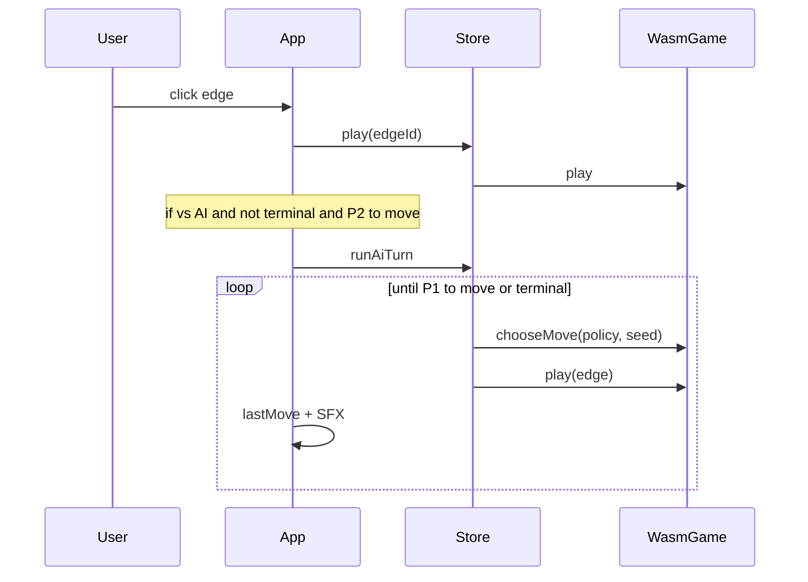

# Spec: Phase 2 vs Random / Greedy UI (thin KET-20)

Play **you vs CPU** in the browser using the KET-15 engines already in
`dab-core`. Thin slice of [KET-20](https://linear.app/sharma01ketan/issue/KET-20/dotsandboxes-web-ai-integration-difficulty-ladder-web-worker)
so Random/Greedy are reachable from the HUD before the full difficulty ladder
and Web Worker exist.

Depends on: [`phase2-random-greedy-engines.md`](./phase2-random-greedy-engines.md) (KET-15).
Builds on: [`phase1-hotseat-board.md`](./phase1-hotseat-board.md).

## Goals

- Mode control: **Hotseat** | **vs Random** | **vs Greedy**.
- Human is always **P1**; AI is **P2**.
- WASM exposes `chooseMove`; JS still applies moves via existing `play`.
- AI auto-plays on its turn (including capture chains / extra turns).
- Motion + SFX for AI moves match human moves.

## Non-goals

- Web Worker, per-move time budget, heavy thinking spinner (light status line OK).
- CGT / MCTS / Perfect difficulties (full ladder stays on KET-20 later).
- AI as P1 / swap sides.
- Theory overlay → [KET-21](https://linear.app/sharma01ketan/issue/KET-21).
- Changing engine algorithms (those live in `dab-core` / KET-15).

## Modes

| Mode | P1 | P2 |
|------|----|----|
| Hotseat | Human | Human |
| vs Random | Human | `RandomEngine` |
| vs Greedy | Human | `GreedyEngine` |

| Setting | Value |
|---------|--------|
| Default | Hotseat |
| Mode change | Starts a **new game** (same as board-size change) |
| Board sizes | Unchanged: 2–5 boxes per side |

## WASM API

Extend [`wasm/src/lib.rs`](../../wasm/src/lib.rs) on `WasmGame`:

```rust
/// policy: 0 = random, 1 = greedy
/// seed: deterministic ties / random choice
/// Returns a legal edge id. Errors if terminal or unknown policy.
#[wasm_bindgen(js_name = chooseMove)]
pub fn choose_move(&mut self, policy: u8, seed: u64) -> Result<u16, JsValue>
```

| Contract | Detail |
|----------|--------|
| Stateless choose | Construct a short-lived `RandomEngine` / `GreedyEngine` from `seed` each call |
| Does not mutate turn | Does **not** call `play`; caller applies the returned edge |
| Terminal | Return `JsValue` error; JS must not call when `isTerminal` |
| Unknown policy | Error |

Rebuild `@dab/dab-wasm` as part of implementation (`pnpm build:wasm` or repo equivalent).

## Web architecture

```
App
├── mode control (Hotseat | vs Random | vs Greedy)
├── useGameStore → WasmGame (play + chooseMove)
└── PixiBoard (ignore clicks while AI turn)
```



### AI turn loop

1. After a successful human `play`, if mode is vs AI, game is not terminal, and
   `currentPlayer === 1` (P2), schedule AI work on the next frame / macrotask
   (`requestAnimationFrame` or `setTimeout(0)`) so claim animation/SFX can start.
2. While AI is active: set a store flag (e.g. `aiBusy`); Pixi ignores edge clicks;
   `play` from human no-ops.
3. Each AI step: `edge = chooseMove(policy, seed)` then `play(edge)` → `PlayOutcome`
   → update snapshot, `lastMove`, SFX (same path as human).
4. If `extraTurn` and not terminal, repeat choose+play (same scheduled turn or
   immediate loop with yields if needed for animation).
5. When `currentPlayer === 0` or terminal, clear `aiBusy`.
6. Seed: derive from a stable game seed + move count (or increment per choose)
   so replays are roughly reproducible without storing engine state in WASM.

### HUD / copy

- Mode control beside board size + New game.
- vs AI: score labels **You** / **CPU (Random)** or **CPU (Greedy)**; turn shows
  “Your turn” / “CPU thinking…” when `aiBusy`.
- Title/lede: Hotseat stays as today; vs AI e.g. “You vs Greedy”.
- Mute, size, New game behavior unchanged (New game keeps current mode).

## Acceptance

- [ ] `pnpm build:wasm` (or equivalent) exposes `chooseMove`; random/greedy return legal edges.
- [ ] Mode toggle: Hotseat | vs Random | vs Greedy; changing mode starts a fresh game.
- [ ] Full game vs Greedy playable end-to-end (captures, extra turns, win/tie).
- [ ] Human cannot click edges during AI turn.
- [ ] AI moves trigger the same motion + SFX path as human moves; mute still works.
- [ ] `pnpm --filter @dab/web lint` and build succeed; core/WASM tests still pass.

## Handoff

| Later | Extends this |
|-------|----------------|
| Full KET-20 | Web Worker, time budget, CGT/MCTS/Perfect entries |
| KET-17 | Drop-in stronger `policy` once CGT engine exists |
| KET-21 | Theory overlay on the same vs-AI board |

## Files

| Path | Role |
|------|------|
| `docs/specs/phase2-vs-ai-hotseat.md` | This spec |
| `wasm/src/lib.rs` | `chooseMove` binding |
| `web/src/game/store.ts` | Mode, `aiBusy`, AI choose+play loop |
| `web/src/App.tsx` | Mode control + schedule AI turns |
| `web/src/board/PixiBoard.tsx` | Respect busy / disable hits on AI turn |
| `core/src/engine.rs` | Existing Random/Greedy (unchanged) |
