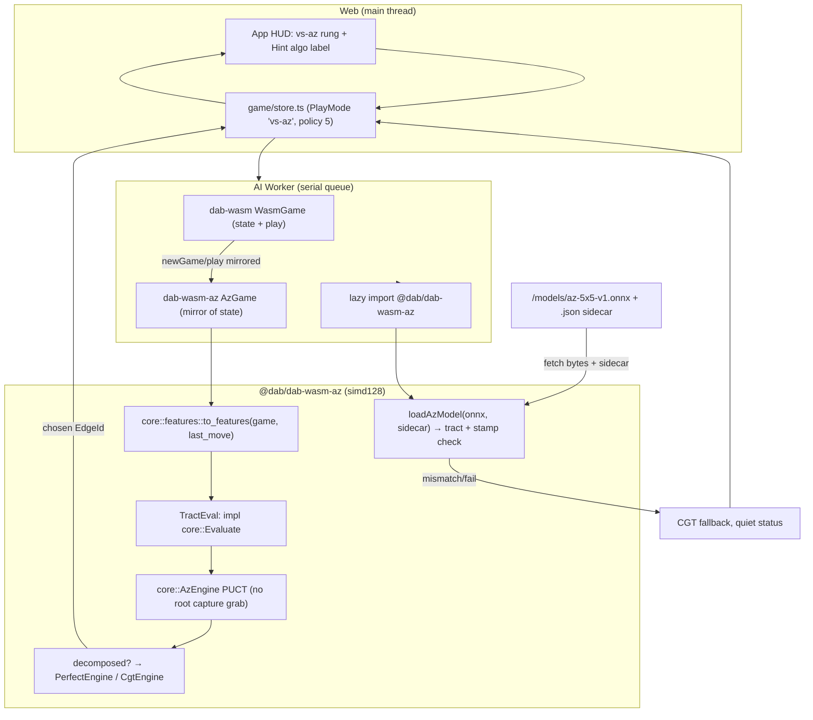

# Spec: Phase 4 in-WASM AlphaZero (tract CPU)

A learned policy/value net played as the **Hard (AZ)** rung, evaluated on the
CPU in the browser via [`tract`](https://github.com/sonos/tract) (SIMD, no
`onnxruntime-web`, no WebGPU). `dab-core` gains a `to_features` encoder, an
`Evaluate` trait, and an `AzEngine` PUCT search with **no tract dependency**;
inference lives in a lazily-fetched second WASM module so the base `dab-wasm`
stays small. Training (`ai/`) is recreated now and runs in parallel.

Linear: **Phase 4 epic** (in-WASM AlphaZero), tickets **A–E** below. Runs
parallel to [KET-25](https://linear.app/sharma01ketan/issue/KET-25) (binary
protocol) — independent files.

Depends on: [`phase2-vs-ai-hotseat.md`](./phase2-vs-ai-hotseat.md) (KET-20 Worker),
[`phase2-mcts.md`](./phase2-mcts.md) (`Engine` + tree conventions),
[`phase2-cgt-endgame-analysis.md`](./phase2-cgt-endgame-analysis.md) (`analyze_endgame`),
[`phase2-exact-solver.md`](./phase2-exact-solver.md) (`PerfectEngine`),
[`phase2-hints.md`](./phase2-hints.md) (Hint shell, KET-22).

---

## Goals

- `core::features`: `to_features(game, last_move)` → a fixed **7 × 11 × 11**
  tensor, plus a **canonical edge → index map** (policy length **60**) reused by
  `ai/`. `Game` has no last-move accessor, so the last `EdgeId` is threaded in.
- `core::Evaluate` trait (net-agnostic) and `AzEngine` PUCT that consumes it.
  Core has **no tract dependency**.
- `AzEngine` **does not grab a root capture** — the net/PUCT may decline a
  completing move (double-cross). This is the opposite of `MctsEngine`.
- Endgame handoff (slice C): when `analyze_endgame().decomposed`, delegate to
  `PerfectEngine` on `isPerfectHudSize` boards (2×2 / 3×3), else `CgtEngine`.
  CGT here is a **heuristic** and does **not** steer long-chain parity.
- Inference in a **separate, lazily-fetched** `@dab/dab-wasm-az` module built
  with `simd128`; base `@dab/dab-wasm` unchanged in size. `POLICY_AZ = 5`.
- Web fetches `/models/*.onnx`; the Worker loads it in its serial queue and
  validates a JSON sidecar **stamp** (filename + source stamp) at load.
  Mismatch or missing/failed model → **fall back to CGT**, quiet status line.
- Training pipeline (`ai/`): PyTorch MPS self-play via `dab-core`, arena
  gating, ONNX export + sidecar.
- HUD adds a **Hard (AZ)** rung beside Hard (CGT) (does not replace CGT or
  MCTS), and **labels which algorithm Hint is using**.

## Non-goals

- `onnxruntime-web`, WebGPU, or any `gpu/` kernels (deferred; PLAN ort-web row
  superseded — see [PLAN.md edits](#planmd-edits)).
- Wall-clock budgets in WASM (`Instant` is unreliable there) — search is bounded
  by **sim count**, not time.
- A live HUD Hint wired to a fixture/random net. Slice A/B ship **plumbing +
  tests only**; no HUD rung until a trained net passes arena (slices D→E).
- Changing MCTS / CGT / Perfect algorithms, or the theory overlay (KET-21).
- AI as P1, or a net that plays the fully-decomposed endgame (slice C hands
  that to Perfect/CGT).
- Recreating `gpu/` / `proto/` / `infra/` (KET-61). `ai/` **is** recreated now.
- A binary protocol dependency — Phase 4 is client-only; KET-25 is orthogonal.

---

## Tensor contract (frozen in slice A)

One concrete layout. Smaller boards embed at the **top-left origin**; the rest
of the plane is zero. This makes the encoding board-size-invariant, so a single
net input covers 2×2…5×5.

- Channels `C = 7`, plane `H = W = 11` (`2 * MAX_BOARD + 1`, MAX_BOARD = 5).
- Interleaved dots/edges/boxes grid, cell `(y, x)`, `y, x ∈ 0..11`:

| Grid cell | Feature location |
|-----------|------------------|
| `(2i, 2j)` | dot `(i, j)` |
| `(2r, 2c+1)` | horizontal edge `H(row=r, col=c)` |
| `(2r+1, 2c)` | vertical edge `V(row=r, col=c)` |
| `(2r+1, 2c+1)` | box `(r, c)` center |

Channels (all values in `{0.0, 1.0}`, from the **side-to-move** perspective):

| Ch | Cells | Meaning |
|----|-------|---------|
| 0 | edge | edge exists on this board **and is undrawn** (spatial legal-move mask) |
| 1 | edge | edge is **drawn** |
| 2 | box | box claimed by **side to move** |
| 3 | box | box claimed by **opponent** |
| 4 | box | box exists on this board **and is unclaimed** (distinguishes real empty box from padding) |
| 5 | on-board | constant plane = `1.0` iff **P1 is to move** (absolute seat → long-chain parity awareness) |
| 6 | edge | **last move**: the edge just drawn (`last_move`); all-zero at game start |

Flatten CHW row-major: `idx = c * 121 + y * 11 + x`; total length **847**.

### Canonical edge → policy index (5×5 strides, size-invariant)

Policy length is **60** = `edge_count(5,5)` (`5*6 + 6*5`). Any board's `EdgeId`
maps into this space via the 5×5 strides, matching
[`BoardGeom::edge_id`](../../core/src/board.rs) but with fixed `cols = 5`:

```
policy_index(H(row=r, col=c)) = r * 5 + c            // 0..29
policy_index(V(row=r, col=c)) = 30 + r * 6 + c       // 30..59
```

For the 5×5 board this is the identity on `EdgeId`. For smaller boards it is a
sparse subset of `0..60`; off-board and drawn indices are masked before argmax.

5×5 anchors (worked): `H(0,0)=0`, `H(5,4)=29`, `V(0,0)=30`, `V(4,5)=59`. On a
3×3 board `H(3,2)=17`, `V(0,3)=33` (same formula, `edge_count(3,3)=24`).

---

## Data flow



---

## Core API — `core/src/features.rs`

```rust
pub const AZ_HUD_ROWS: u8 = 5;
pub const AZ_HUD_COLS: u8 = 5;
pub const AZ_CHANNELS: usize = 7;
pub const AZ_PLANE: usize = 11;          // 2 * AZ_HUD_ROWS + 1
pub const AZ_FEATURES: usize = AZ_CHANNELS * AZ_PLANE * AZ_PLANE; // 847
pub const AZ_POLICY: usize = 60;         // edge_count(5, 5)
pub const AZ_FEATURES_VERSION: u32 = 1;  // stamped; bump on any layout change

/// 7×11×11 CHW tensor from the side-to-move perspective.
/// `last_move` is threaded in because `Game` has no last-move accessor.
pub fn to_features(game: &Game, last_move: Option<EdgeId>) -> [f32; AZ_FEATURES];

/// Board-size-invariant edge → policy index (5×5 strides).
pub fn policy_index(geom: BoardGeom, edge: EdgeId) -> usize;

/// Inverse: canonical index → this board's EdgeId, if it exists on-board.
pub fn edge_from_policy_index(geom: BoardGeom, idx: usize) -> Option<EdgeId>;

/// `true` at indices that are legal (on-board and undrawn) for `game`.
pub fn legal_policy_mask(game: &Game) -> [bool; AZ_POLICY];
```

Re-exported from `core/src/lib.rs` alongside the existing `pub use` block.

## Core API — `core/src/az.rs`

```rust
/// Net-agnostic evaluator. Core carries NO tract dependency; the WASM AZ
/// module supplies the tract-backed implementor.
pub trait Evaluate {
    /// Returns (policy logits length AZ_POLICY, value in [-1, 1]) for the
    /// side to move, given a `to_features` tensor.
    fn evaluate(&self, features: &[f32]) -> (Vec<f32>, f32);
}

pub struct AzEngine<'e, E: Evaluate> { /* eval, sims, c_puct, rng, root last_move */ }

impl<'e, E: Evaluate> AzEngine<'e, E> {
    pub fn new(eval: &'e E, seed: u64) -> Self;   // default sims = 32, c_puct = 1.5
    pub fn with_sims(self, sims: u32) -> Self;
    pub fn with_last_move(self, last_move: Option<EdgeId>) -> Self; // root only
    /// Cheap hint path: net policy argmax over legal moves, no tree.
    pub fn policy_argmax(&self, game: &Game) -> EdgeId;
}

impl<'e, E: Evaluate> Engine for AzEngine<'e, E> {
    fn choose(&mut self, game: &Game) -> EdgeId; // PUCT; endgame handoff (slice C)
}
```

**PUCT.** `Game` is `Copy`; the tree stores copies. Priors are the softmax of
net logits **masked to legal moves** (`legal_policy_mask`). A leaf is **fully
expanded** (one net eval → all legal children). Selection:
`argmax_a [ Q(a) + c_puct · P(a) · √N(parent) / (1 + N(a)) ]`
(`N(parent)` is the standard AlphaZero form; `√Σ_b N(b)` is 0 before any child
is visited and would ignore the prior). Leaves are scored by the net `value`
(side-to-move perspective), **not** by rollouts. Backup negamax: a normal move
flips the sign between plies; an **extra-turn** (capturing) child keeps the
same to-move, so it keeps the sign — identical to the MCTS tree convention.
`choose` returns the **most-visited** root child (RNG on ties via `XorShift64`).
No Dirichlet noise at inference.

**No root capture grab.** Unlike `MctsEngine`
([`core/src/mcts.rs`](../../core/src/mcts.rs)), `AzEngine` does **not** special-case
a completing move at the root; capturing children compete in PUCT like any
other, so the net may **decline** the last box of a chain (double-cross).

**Endgame handoff (slice C).** Before searching, if `analyze_endgame(game).decomposed`:
delegate to `PerfectEngine` when `is_perfect_hud_size(rows, cols)` (2×2 / 3×3),
otherwise `CgtEngine`. `decomposed` is **false** while any unclaimed box has 3
or 4 sides, and an empty board is not decomposed, so the net owns the opening
and midgame. **CGT here is heuristic** — `CgtEngine` implements double-cross /
all-but-four but does **not** steer long-chain parity; parity remains a teaching
signal in the overlay (KET-21) only.

---

## WASM boundary

Two modules. The base module is unchanged except for a reserved policy code.

### Base `@dab/dab-wasm` ([`wasm/src/lib.rs`](../../wasm/src/lib.rs))

```rust
/// `choose_move` policy: AlphaZero (evaluated in the lazily-loaded AZ module).
pub const POLICY_AZ: u8 = 5;
```

Exported as `POLICY_AZ()`. Base `chooseMove(5, …)` returns an error
(`"AZ runs in the @dab/dab-wasm-az module"`) — the net and PUCT are **not**
linked into the base binary. Base stays tract-free and same-size.

### New crate `wasm-az/` → `@dab/dab-wasm-az` (lazy, `simd128`)

`wasm-az/Cargo.toml`: `crate-type = ["cdylib"]`, deps `dab-core`, `tract-onnx`,
`wasm-bindgen`, `console_error_panic_hook`. Added to the Cargo workspace
`members`. Built with `RUSTFLAGS="-C target-feature=+simd128"`.

Exact JS names (data-oriented, mirroring the base module):

| JS name | Signature | Role |
|---------|-----------|------|
| `default init()` | `() => Promise<InitOutput>` | wasm-bindgen init (lazy `import()`) |
| `AZ_CHANNELS()` / `AZ_PLANE()` / `AZ_POLICY()` | `() => number` | contract consts (7 / 11 / 60) |
| `loadAzModel(onnx, sidecar)` | `(Uint8Array, string) => void` | parse ONNX via tract, **validate stamp**, store thread-local model; throws on any mismatch |
| `azModelStamp()` | `() => string` | loaded sidecar JSON, or `""` if none |
| `class AzGame` | `new AzGame(rows, cols)` | dab-core `Game` mirror (own state) |
| `AzGame.play(edge)` | `(number) => void` | keep the mirror in sync with the Worker's `WasmGame` |
| `AzGame.chooseMoveAz(lastMove, sims, seed)` | `(number /* -1 = none */, number, bigint) => number` | run `AzEngine` PUCT + endgame handoff; returns `EdgeId` |
| `AzGame.policyArgmax(lastMove)` | `(number) => number` | net argmax, no search (cheap Hint) |

`loadAzModel` refuses (throws → CGT fallback) unless **all** hold: sidecar
`schema` known; `boardRows/boardCols` equal the **pad size** (`AZ_HUD_ROWS` /
`AZ_HUD_COLS` = 5), not the live `AzGame` (the tensor is size-invariant, so one
5×5 net covers 2×2…5×5); `channels/plane/policyLength` equal
`AZ_CHANNELS/AZ_PLANE/AZ_POLICY`; `featuresVersion == AZ_FEATURES_VERSION`;
`sourceStamp` equals the running `SOURCE_STAMP`; `onnxSha256` equals SHA-256 of
the fetched bytes; sidecar `name` equals the `.onnx` filename base (Worker
checks basename; wasm-az checks the field is present and well-formed).

### Worker + client

`web/src/game/aiWorkerProtocol.ts` — new messages:

```ts
export type AiWorkerBody =
  | { type: 'newGame'; rows: number; cols: number }
  | { type: 'play'; edge: number }
  | { type: 'chooseMove'; policy: number; seed: bigint }
  | { type: 'perfectValue' }
  | { type: 'loadAzModel'; url: string; sidecarUrl: string }        // NEW
  | { type: 'azChooseMove'; lastMove: number | null; sims: number; seed: bigint } // NEW
  | { type: 'azStatus' };                                           // NEW → 'loaded' | 'none' | 'error'
```

`web/src/game/aiWorker.ts` — on first AZ use, `await import('@dab/dab-wasm-az')`,
init, construct `AzGame(rows, cols)`, and **mirror** every `newGame`/`play`
already applied to the base `WasmGame` so the AZ state matches. The Worker
tracks the last applied `EdgeId` and threads it into `azChooseMove` /
`policyArgmax`. `loadAzModel` fetches bytes + sidecar and calls the wasm
loader; any throw is reported as `azStatus: 'error'` and the caller stays on
CGT. Search stays in the Worker (serial queue in
[`aiClient.ts`](../../web/src/game/aiClient.ts)); no main-thread inference.

---

## Model artifacts + stamp schema

Shipped under `web/public/models/` (fetched from `/models/…`). Filename encodes
size + version: `az-5x5-v1.onnx`, with sidecar `az-5x5-v1.json`:

```json
{
  "schema": "dab-az-model/1",
  "name": "az-5x5-v1",
  "boardRows": 5,
  "boardCols": 5,
  "channels": 7,
  "plane": 11,
  "policyLength": 60,
  "valueRange": [-1, 1],
  "featuresVersion": 1,
  "sourceStamp": "<git hash matching wasm/pkg/SOURCE_STAMP>",
  "onnxSha256": "<hex sha256 of az-5x5-v1.onnx>",
  "createdAt": "2026-09-01T00:00:00Z",
  "trainedSteps": 200000,
  "arena": { "vsCgt": 0.62, "vsMcts": 0.71 }
}
```

`sourceStamp` ties the model to the **tensor contract** (`core` + `wasm-az`),
via [`scripts/wasm-az-source-stamp.sh`](../../scripts/wasm-az-source-stamp.sh).
The base [`scripts/wasm-source-stamp.sh`](../../scripts/wasm-source-stamp.sh)
stays `core` + `wasm` only so AZ-only edits do not rebuild `@dab/dab-wasm`.
A drifted contract fails the stamp check → CGT fallback.

---

## HUD (slice E)

- New `PlayMode` `'vs-az'`, label **Hard (AZ)**, placed beside **Hard (CGT)** in
  `PLAY_MODES` ([`web/src/game/store.ts`](../../web/src/game/store.ts)). CGT and
  MCTS rungs are untouched.
- `policyForMode('vs-az') = 5`; `hintPolicyForMode('vs-az') = 5`. **vs-perfect
  Hint stays Perfect.** Until `vs-az` exists, Hint keeps echoing the selected
  engine — **AZ Hint only inside vs-az**.
- Hint highlight is unchanged (KET-22 shell: highlight, don't play, bound to
  `gameGeneration`). Add a small **algorithm label** next to Hint / in the
  status line naming the engine Hint used:

```ts
export function hintAlgoLabel(mode: PlayMode): string {
  switch (mode) {
    case 'vs-random': return 'Random';
    case 'vs-greedy': return 'Greedy';
    case 'vs-mcts':   return 'MCTS';
    case 'vs-cgt':    return 'CGT';
    case 'vs-perfect':return 'Perfect';
    case 'vs-az':     return 'AZ';
    default:          return 'CGT'; // Opponent (hotseat)
  }
}
```

- AZ turn budget vs Hint budget: Hint uses `policyArgmax` or ~**16–32** PUCT
  sims; the CPU AZ turn uses a higher sim count. No wall-clock in WASM.
- If the model is missing / fails / stamp-mismatches, the `vs-az` rung plays
  **CGT** and shows a quiet one-line status (e.g. `AZ net unavailable — using CGT`).
  KET-21 overlay and the KET-22 shell (highlight, don't play, generation abort)
  are unchanged; the chooser stays **mode-echo** until this slice.

---

## `ai/` training pipeline (slice D)

Recreated now, parallel to A–C (shares only the frozen tensor contract).

| Path | Role |
|------|------|
| `ai/pyproject.toml` | `uv`/PyTorch (MPS) deps |
| `ai/selfplay/` | self-play driver over `dab-core` (Rust self-play binary emitting `(features, π, z)` samples, or PyO3 bindings) |
| `ai/model.py` | small **ResNet**, 7-channel input → (policy logits 60, value) |
| `ai/train.py` | policy CE + value MSE; checkpoints |
| `ai/arena.py` | gate vs previous best / CGT / MCTS (Elo-style) |
| `ai/export_onnx.py` | export `.onnx` + write the sidecar stamp (reads `SOURCE_STAMP`) |

D may run parallel to A–C **except** the tensor contract (channels, plane,
policy map, `featuresVersion`), which must be frozen in slice A first.

---

## Slices (MUST NOT merge)

### Slice A — features + `Evaluate` + tract load (plumbing/tests only)
- [ ] `core::features`: `to_features`, `policy_index`, `edge_from_policy_index`,
      `legal_policy_mask`, consts; re-exported from `lib.rs`.
- [ ] `core::az::Evaluate` trait; core has **no** tract dep.
- [ ] `wasm-az/` crate: `loadAzModel` (tract parse + stamp validation),
      `azModelStamp`, consts; builds with `simd128`.
- [ ] Tests: feature-tensor golden on hand-built positions; canonical
      index round-trip for all 2×2…5×5 edges; last-move channel set iff
      `last_move` given; stamp accept + each reject reason; loading a
      fixture/random ONNX yields policy length 60 and value in `[-1, 1]`.
- [ ] CI knows the second wasm package (build + AZ stamp/glue diff).
      Base `pnpm build:wasm` does **not** pack `wasm-az` (keeps board iteration
      fast). `pnpm build:wasm-az` is separate.
- [ ] **No** HUD rung; **no** Hint wired to a fixture/random net.

### Slice B — `AzEngine` PUCT
- [x] `AzEngine` implements `Engine`; deterministic given seed + sims.
- [x] Extra-turn: a capturing child has the same `current_player` as its parent
      (sign preserved on backup).
- [x] **AZ can decline a completing move at the root** (no root capture grab) —
      test with an evaluator whose prior/value favors declining.
- [x] `choose` returns a legal, undrawn edge; `policy_argmax` returns the legal
      net argmax.
- [x] With a fixture/random `Evaluate`: legality + determinism only (real
      strength waits for D).

### Slice C — endgame cutoff
- [ ] `decomposed` → `PerfectEngine` on 2×2/3×3, else `CgtEngine`; net owns the
      non-decomposed midgame.
- [ ] Spec/test note: `decomposed` is false while any box has 3–4 sides; empty
      board not decomposed.
- [ ] Test/doc: **CGT is heuristic and does not steer long-chain parity.**

### Slice D — training (`ai/`)
- [ ] Self-play over `dab-core`; ResNet 7-ch → (policy 60, value).
- [ ] Arena gating vs previous best / CGT / MCTS.
- [ ] ONNX export + sidecar stamp (SHA-256 + `sourceStamp`).
- [ ] Parallel to A–C except the frozen tensor contract.

### Slice E — HUD `vs-az` + labels
- [ ] `vs-az` rung **Hard (AZ)** beside Hard (CGT); CGT/MCTS unchanged.
- [ ] Worker `loadAzModel` + `azChooseMove`; `AzGame` mirror + last-move thread.
- [ ] Hint algorithm label (CGT / MCTS / Greedy / Perfect / AZ / Random);
      vs-perfect Hint stays Perfect; AZ Hint only inside vs-az.
- [ ] Missing/failed/mismatched model → CGT fallback, quiet status.
- [ ] Depends on D for a real net; HUD copy unchanged until then.

---

## Acceptance

- [ ] `to_features` is deterministic, side-to-move relative, last-move channel
      correct; canonical index round-trips all sizes; length 847 / policy 60.
- [ ] Base `@dab/dab-wasm` unchanged in size; `POLICY_AZ = 5` reserved; base
      `chooseMove(5)` errors.
- [ ] `@dab/dab-wasm-az` builds with `simd128`, loads an ONNX via tract, and
      round-trips `evaluate` (policy 60, value ∈ [-1, 1]).
- [x] `AzEngine` deterministic (seed + sims); declines a completing move at root
      in the decline test; extra-turn preserves to-move.
- [ ] Decomposed positions route to Perfect (2×2/3×3) / CGT; midgame uses the net.
- [ ] Stamp mismatch (size / channels / plane / policy / version / sourceStamp /
      sha256 / filename) → refuse → CGT fallback with a quiet status line.
- [ ] `cargo test -p dab-core`; `cargo test` (workspace) incl. `wasm-az` unit
      tests; `wasm-pack build wasm` **and** `wasm-pack build wasm-az` glue +
      source stamp unchanged in CI; web lint / tsc / test.

---

## CI (KET-47 extension)

- Add a second `wasm-pack build wasm-az --target web --out-dir pkg --scope dab
  --no-opt` with `RUSTFLAGS="-C target-feature=+simd128"`, then
  `scripts/wasm-az-source-stamp.sh` + glue diff (`git diff --exit-code --
  wasm-az/pkg ':!wasm-az/pkg/*.wasm'`). Base `wasm-source-stamp.sh` is unchanged.
- `wasm-opt` stays a deploy-time step (CI remains `--no-opt`).
- Rust job: `cargo clippy --workspace --all-targets -D warnings` and
  `cargo test --workspace` now cover `wasm-az`. `ai/` is Python (own lint/test,
  not gated on the Rust job).

---

## PLAN.md edits

- §4 tool table row **“Neural inference (hard AI) | ONNX Runtime Web + WebGPU”**
  is **superseded for v1**: replace with **tract (CPU, `simd128`) in a
  lazily-loaded WASM module**; ort-web / WebGPU deferred to a later phase.
- §3 architecture diagram annotation `Neural inference (ONNX Runtime Web +
  WebGPU)` and §6.2 “ONNX Runtime Web + WebGPU inference in-browser” — mark as
  the later fast path; v1 is tract CPU.
- §6.1 difficulty ladder: **AlphaZero (Hard)** becomes real as HUD **Hard (AZ)**
  beside **Hard (CGT)** (MCTS stays **Medium (MCTS)**).
- §11: `ai/` is recreated in Phase 4; `gpu/` / `proto/` / `infra/` stay out
  (KET-61 still holds for those three).

---

## Handoff

| Next | Uses this |
|------|-----------|
| Later WebGPU / ort-web fast path | Same `Evaluate` trait + tensor contract; swap the evaluator, keep `AzEngine` |
| `gpu/` batched rollouts (Phase 4/5) | `to_features` + canonical policy map |
| Server-side ranked inference | `dab-core` `AzEngine` links natively (native tract or `ort`) |

## Files

| Path | Role |
|------|------|
| `docs/specs/phase4-in-wasm-az.md` | This spec |
| `core/src/features.rs` | `to_features`, canonical edge↔index, masks, consts |
| `core/src/az.rs` | `Evaluate` trait + `AzEngine` PUCT (no tract dep) |
| `core/src/lib.rs` | re-export `features` + `az` |
| `wasm/src/lib.rs` | `POLICY_AZ = 5` (base stays tract-free) |
| `wasm-az/Cargo.toml`, `wasm-az/src/lib.rs` | tract `Evaluate`, `loadAzModel`, `AzGame`, stamp check (`simd128`) |
| `Cargo.toml` | add `wasm-az` to workspace members |
| `scripts/wasm-az-source-stamp.sh` | AZ module stamp (`core` + `wasm-az`) |
| `.github/workflows/ci.yml` | second wasm-pack build + stamp/glue diff |
| `web/src/game/aiWorkerProtocol.ts` | `loadAzModel` / `azChooseMove` / `azStatus` |
| `web/src/game/aiWorker.ts` | lazy AZ import, `AzGame` mirror, last-move thread |
| `web/src/game/aiClient.ts` | serial queue methods for the new messages |
| `web/src/game/store.ts` | `vs-az` mode, `policyForMode`/`hintPolicyForMode`, `hintAlgoLabel`, CGT fallback |
| `web/src/App.tsx` | Hard (AZ) rung + Hint algorithm label + status |
| `web/public/models/az-5x5-v1.onnx` + `.json` | shipped net + stamp sidecar |
| `ai/` | PyTorch MPS self-play, arena, ONNX export + stamp |
| `PLAN.md` | ort-web row superseded; ladder + `ai/` notes |
